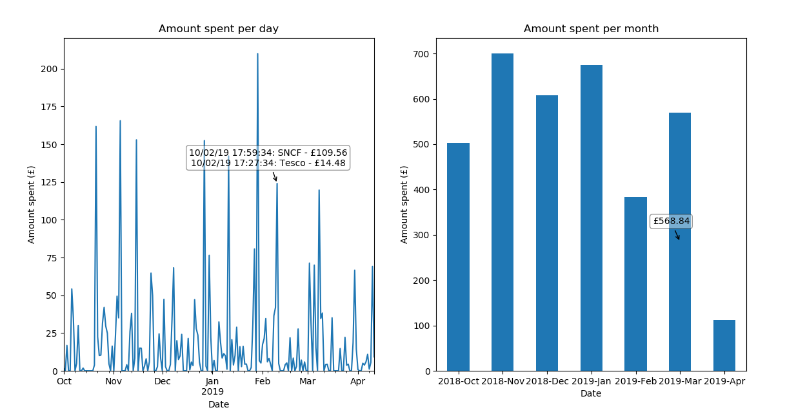

# StarlingBankSpendingGraph

Currently, the [Starling Bank mobile app](https://www.starlingbank.com/) does not have a easy-to-read overview of spending amounts for each day and each month (as shown below - it requires manually selecting each month in the past), which this Python project attempts to solve.

This script uses the Starling Developer API to get the transactions between 2 specified dates for your account, then filter the outbound transactions and group them by day and month with Pandas.
The graphs for transactions for each day and each month are then shown with matplotlib (as a line graph and bar chart respectively).

The exact amount is displayed when hovering, and the largest 5 transactions are displayed when clicking the line graph or bar chart.

## Running the script 
Add "StarlingPersonalAccessToken" as an environmental variable, after creating the personal access token with read permissions for your account at https://developer.starlingbank.com/personal/token

Run spending_graph.py

 