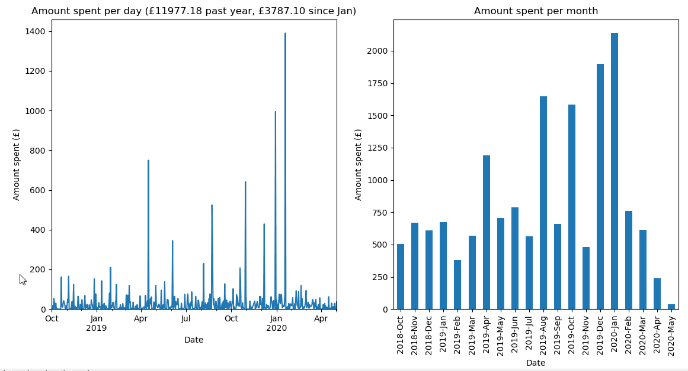

# StarlingBankSpendingGraph

Currently, the [Starling Bank mobile app](https://www.starlingbank.com/) does not have a easy-to-read overview of spending amounts for each day and each month (as shown below - it requires manually selecting each month in the past), which this Python project attempts to solve.


This script uses the Starling Developer API to get the transactions between 2 specified dates for your account, then filter the outbound transactions and group them by day and month with Pandas.

The format of the API response data is as below:
```
{
  "feedItems": [
    {
      "feedItemUid": "11221122-1122-1122-1122-112211221122",
      "categoryUid": "ccddccdd-ccdd-ccdd-ccdd-ccddccddccdd",
      "amount": {
        "currency": "GBP",
        "minorUnits": 123456
      },
      "sourceAmount": {
        "currency": "GBP",
        "minorUnits": 123456
      },
      "direction": "IN",
      "updatedAt": "2020-05-02T11:08:45.089Z",
      "transactionTime": "2020-05-02T11:08:45.089Z",
      "settlementTime": "2020-05-02T11:08:45.089Z",
      "retryAllocationUntilTime": "2020-05-02T11:08:45.089Z",
      "source": "MASTER_CARD",
      "sourceSubType": "CONTACTLESS",
      "status": "PENDING",
      "transactingApplicationUserUid": "aaaaaaaa-aaaa-4aaa-aaaa-aaaaaaaaaaaa",
      "counterPartyType": "MERCHANT",
      "counterPartyUid": "68e16af4-c2c3-413b-bf93-1056b90097fa",
      "counterPartyName": "Tesco",
      "counterPartySubEntityUid": "35d46207-d90e-483c-a40a-128cc4da4bee",
      "counterPartySubEntityName": "Tesco Southampton",
      "counterPartySubEntityIdentifier": "608371",
      "counterPartySubEntitySubIdentifier": "01234567",
      "exchangeRate": 0,
      "totalFees": 0,
      "reference": "TESCO-STORES-6148      SOUTHAMPTON   GBR",
      "country": "GB",
      "spendingCategory": "GROCERIES",
      "userNote": "Tax deductable, submit me to payroll",
      "roundUp": {
        "goalCategoryUid": "68e16af4-c2c3-413b-bf93-1056b90097fa",
        "amount": {
          "currency": "GBP",
          "minorUnits": 123456
        }
      },
      "hasAttachment": true
    }
  ]
}
```

The graphs for transactions for each day and each month are then shown with matplotlib (as a line graph and bar chart respectively).

The exact amount is displayed when hovering, and the largest 5 transactions are displayed when clicking the line graph or bar chart.



## Running the script 
Add "StarlingPersonalAccessToken" as an environmental variable, after creating the personal access token with read permissions for your account at https://developer.starlingbank.com/personal/token

In the `config.ini` file, set the `transactions_start_date` to the date you want to start showing data from.

Assuming you have installed Python 3,
in the root project folder run `$pip install -r requirements.txt`, then `$python spending_graph.py`.

If you have made some purchases for multiple people and they paid you back later, and want to divide the amount to be more accurate to what you spent, run `$python spending_list.py`. This will create an Excel file `outbound_transactions.xlsx` which lists all outbound transactions made.
After identifying the `feedItemUid` of the transaction to divide, add it to `feed_items_to_divide` in the `config.ini` file, along with the number to divide by. Similarly, to ignore transactions completely, add the id to `feed_items_to_ignore`.


 